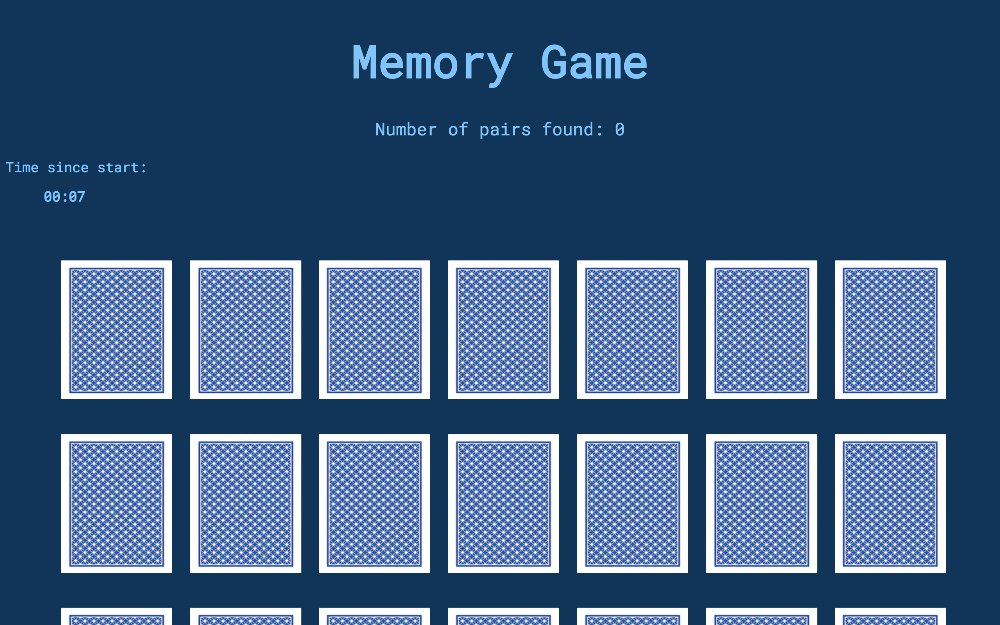
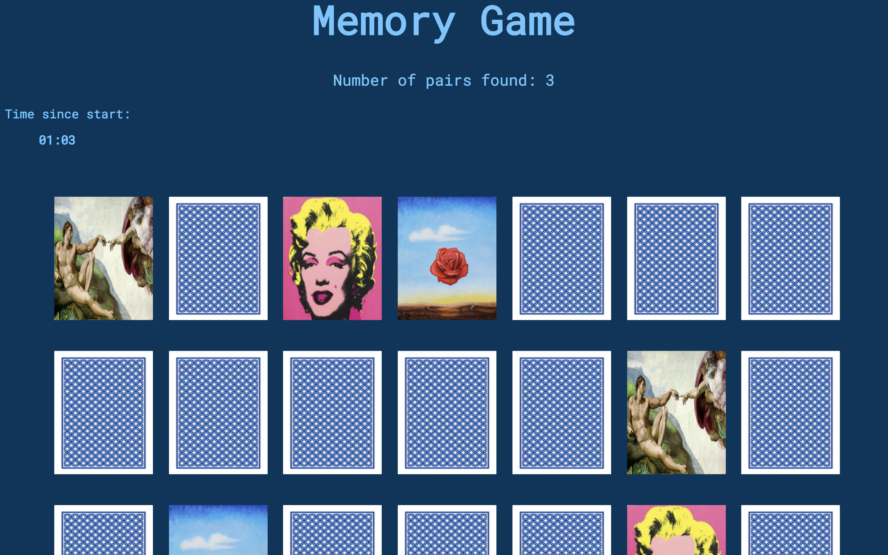

# wdi-project-one

## Memory Game

[See the Game](https://github.com/isib00/wdi-project-one/tree/gh-pages)

### Start Page



### While Playing


### End of the Game


### Different steps that I have taken

1. Create the basic structure of the page in JavaScript
1. Choose the images
1. Create the peseudocode for the game logic
1. Code the game logic to reach the MVP
1. Display the number of pairs found
1. Styling
1. Create a stopwatch
1. Add music effect when pair is found


### Brief summary of the game logic

* Every card is an object (created with a class) in an array containing all cards. Every pair has  a caracteristic number.
* The 2 cards that are clicked on are pushed into an empty array.
* The specific number of the 2 cards are compared.
* If it is the same number, it is a pair and a sound plays. The cards stay as they are. The number of pairs found score increases by 1.
* If it is not the same number, the cards turn around again after 0.7 seconds.
* Every card of a found pair is pushed into a new array. If that array contains all of the cards, the game is over.


### Most important functions of the Game

Flips the cards over and gets the caracteristic number of it:

``` javascript
function handleCardBackClick(event) {
  cardsclicked++;
  const clickedElement = event.target;
  clickedElement.classList.add('flipped');
  cardsInPlay.push(clickedElement);
  const cardNumber = clickedElement.parentElement.getAttribute('card-number');
  if (cardsclicked === 1) {
    firstCard = cardNumber;
  } else if (cardsclicked === 2) {
    secondCard = cardNumber;
    checkForPairs();
  }
}
```

Compares the numbers to see if it is a pair and takes the necessary steps if it is:

``` javascript
function checkForPairs() {
  console.log(firstCard , secondCard);
  if (firstCard === secondCard) {
    console.log('You have found a pair!');
    cardsInPlay.forEach(card => {
      cardsOutOfGame.push(card);
      card.style.opacity = 0;
      console.log('these are the found cards in cardsOutOfGame' , cardsOutOfGame);
      const sound = document.querySelector('.sound');
      sound.play();
    });
    score++;
    scoreBoard.innerHTML = score;
    checkForEndOfGame();
    cardsInPlay = [];
    cardsclicked = 0;
  } else {
    console.log('This is not a pair. Try again!');
    setTimeout(() =>  {
      cardsInPlay.forEach(card => {
        console.log('this is the card' , card);
        card.classList.remove('flipped');
      });
      cardsInPlay = [];
      cardsclicked = 0;
    },700);
  }
}
```


Checks if the game is over each time that a pair has been found:

``` javascript
function checkForEndOfGame() {
  if (cardsOutOfGame.length === 42) {
    const playTime = stopWatch;
    clearInterval(stopWatch);
    scoreBoard2.innerHTML = `Congratulations! It took you ${playTime}`;
    scoreBoard2.style.color = 'rgba(108, 197, 255, 1)';
    scoreBoard2.sytle.fontSize = '25px';
    scoreBoard2.style.textAlign= 'center';
  }
}
```

Stopwatch:

``` javascript
const timer = document.querySelector('.timer');
let minutes = 0;
let seconds = 0;

const stopWatch = setInterval(() => {
  seconds++;
  if (seconds === 60) {
    minutes++;
    seconds = 0;
  }
  timer.innerHTML = `${formatNumber(minutes)}:${formatNumber(seconds)}`;
},1000);

function formatNumber(num) {
  return num < 10 ? `0${num}` : num;
}
```

### Technologies used

* HTML5 with HTML5 audio
* CSS3
* JavaScript (ECMA Script 6)
* Git
* Github
* Google Fonts
* Adobe Colorwheel


### Future Features

* Different Levels
* Highscore Board
* Make the game mobile-first
* Shuffle the cards again when half of them are left
* Add animations when a pair is found
